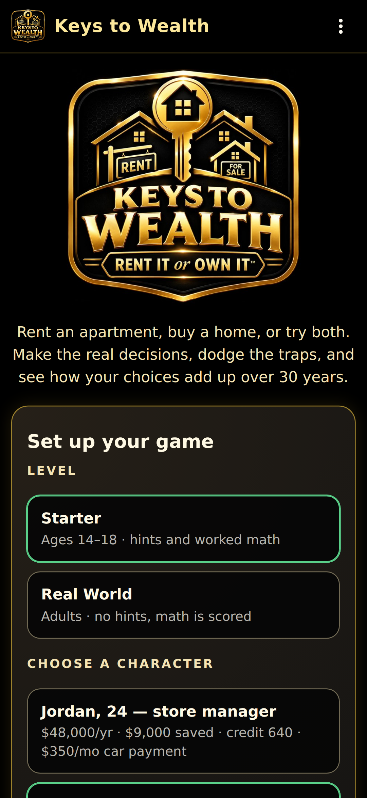
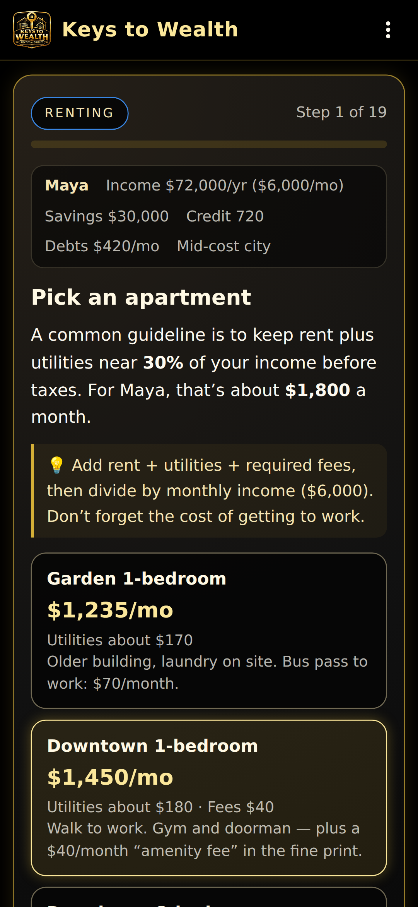
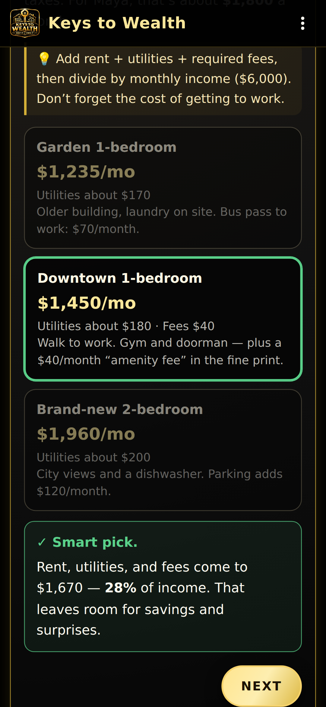
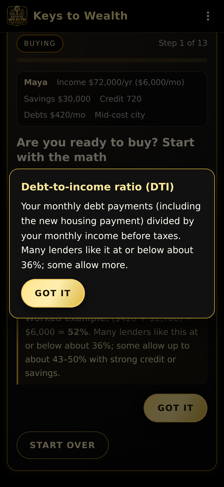
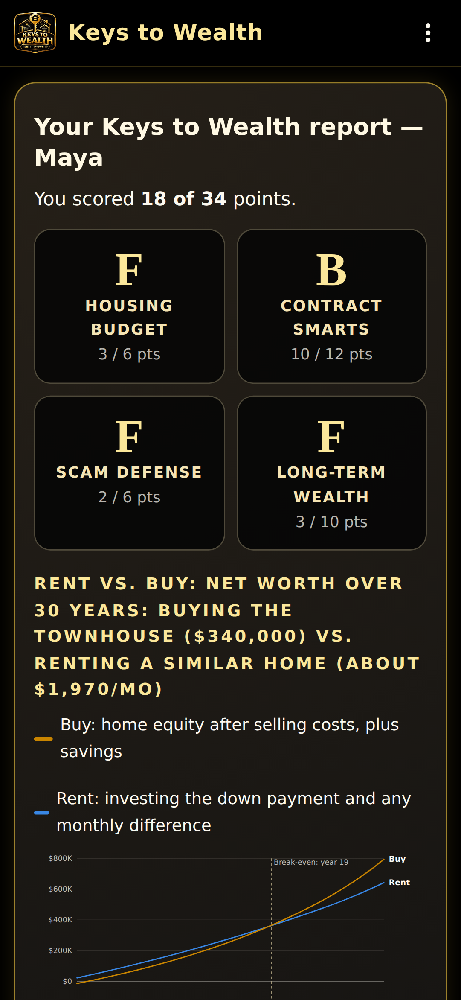
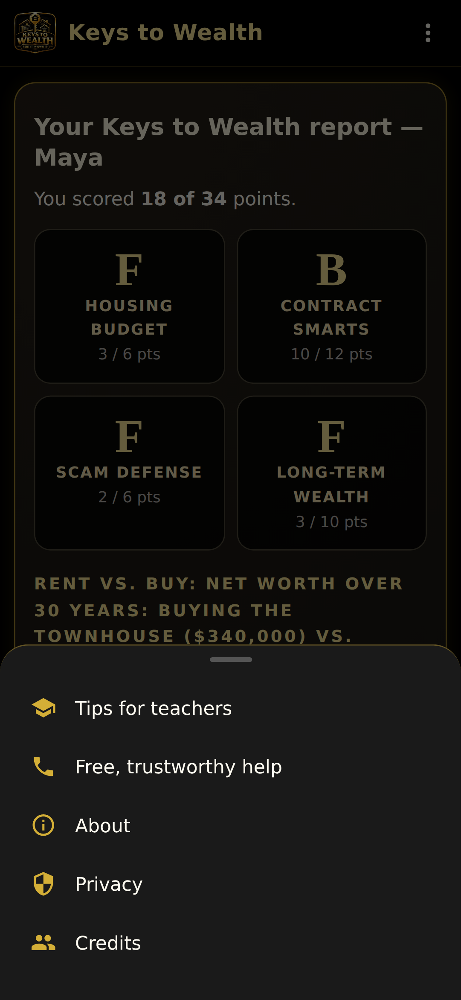

# WGRALGO Keys to Wealth™: Rent It or Own It

**Version: 1.0.1**

A free, fully-offline Android housing and wealth game from
**WGRALGO / The Wealth Gap Resolution Algorithm™ Inc.**

Rent an apartment, buy a home, or try both. Make the real decisions, dodge the
traps, and see how your choices add up over 30 years.

## Features

- Two levels: **Starter** (ages 14–18, hints and worked math) and **Real World**
  (adults, no hints, the math is scored)
- Three characters with different incomes, savings, credit, and debts
- Lower-, mid-, and high-cost cities
- Three paths: **Rent** (6 decisions), **Buy** (13 decisions), or **Both**
  (rent first, then buy, and compare)
- Real decisions and traps: budgeting, lease fine print, rental and wire-fraud
  scams, debt-to-income, loan types, down payments, PMI, inspections, and more
- Instant feedback after every choice, with the math explained
- Tap any underlined term for a plain-English definition
- Results report: grades for Housing Budget, Contract Smarts, Scam Defense, and
  Long-Term Wealth, plus an interactive 30-year rent vs. buy net-worth chart
- Native-style app: app bar, big logo on the launcher icon and splash screen,
  slide-up Tips for teachers, Free help, About, Privacy, and Credits
- No ads, no tracking, no accounts, no internet

## Screenshots

Captured from v1.0.0 at phone size (393dp wide).

| Home | Decision | Feedback |
|------|----------|----------|
|  |  |  |

| Definition | Rent vs. buy chart | Menu |
|------------|--------------------|------|
|  |  |  |

## Offline & Privacy

Keys to Wealth runs fully offline. It requests **no Android permissions**,
including no `INTERNET` permission. It does not collect personal data, show
ads, use analytics or trackers, require an account, or save anything on the
device. See [PRIVACY.md](PRIVACY.md).

## Install / Sideload

1. Download `WGRALGO-KeysToWealth-v1.0.1.apk` from the
   [Releases page](../../releases).
2. On your Android device, allow **Install unknown apps** for your browser or
   file manager.
3. Open the APK and tap **Install**.

Verify the download with the `.sha256` file attached to the release:
`sha256sum -c WGRALGO-KeysToWealth-v1.0.1.apk.sha256`

Release signing certificate (`CN=WGRALGO, OU=Keys to Wealth`), SHA-256 fingerprint:

`7F:03:30:AB:75:1C:DC:AD:E1:3A:01:3B:04:2E:0B:08:92:46:53:5F:2E:3E:C5:E9:52:B0:4B:88:8F:FC:7D:33`

## How to Build

Requirements: JDK 17, Android SDK (platform 34, build-tools 34). No other
dependencies: the app is a single offline WebView.

```bash
./gradlew assembleDebug      # app/build/outputs/apk/debug/app-debug.apk
./gradlew assembleRelease    # signed if a keystore is configured
bash tools/validate-release.sh [path/to/app.apk]
```

For a signed release, create `keystore.properties` at the project root
(git-ignored), or set the `KTW_KEYSTORE_FILE`, `KTW_KEYSTORE_PASSWORD`,
`KTW_KEY_ALIAS`, and `KTW_KEY_PASSWORD` environment variables:

```
storeFile=/absolute/path/to/release.keystore
storePassword=********
keyAlias=********
keyPassword=********
```

### Publishing a release from GitHub

The **Android Signed Release** workflow (`.github/workflows/release.yml`)
builds, signs, validates, and publishes the APK to GitHub Releases. It reads
the keystore from repository secrets (Settings → Secrets and variables →
Actions): `KTW_KEYSTORE_BASE64` (the keystore, base64-encoded),
`KTW_KEYSTORE_PASSWORD`, `KTW_KEY_ALIAS`, and `KTW_KEY_PASSWORD`. Bump
`versionCode` / `versionName` in `app/build.gradle` and the version in the
About sheet, add a CHANGELOG entry and `release-notes/v<version>.md`, then run
the workflow from the Actions tab on `main`.

## Project Structure

```
app/src/main/assets/www/index.html   (the whole game: HTML, CSS, JS)
app/src/main/assets/www/logo.jpg
app/src/main/java/com/wgra/keystowealth/MainActivity.java
app/src/main/res/                    (launcher icon, splash screen, theme)
tools/validate-release.sh            (release checks)
.github/workflows/                   (debug build on every push, signed release)
release-notes/
```

## Disclaimer

For education only — not financial or legal advice. All numbers are examples;
real rates, prices, taxes, insurance, and laws vary by place and change over
time. For free, trustworthy help, see a HUD-approved housing counselor
(1-800-569-4287) or consumerfinance.gov.

## License

GNU General Public License v3.0 — see [LICENSE](LICENSE).

## Contributors

See [CONTRIBUTORS.md](CONTRIBUTORS.md).
